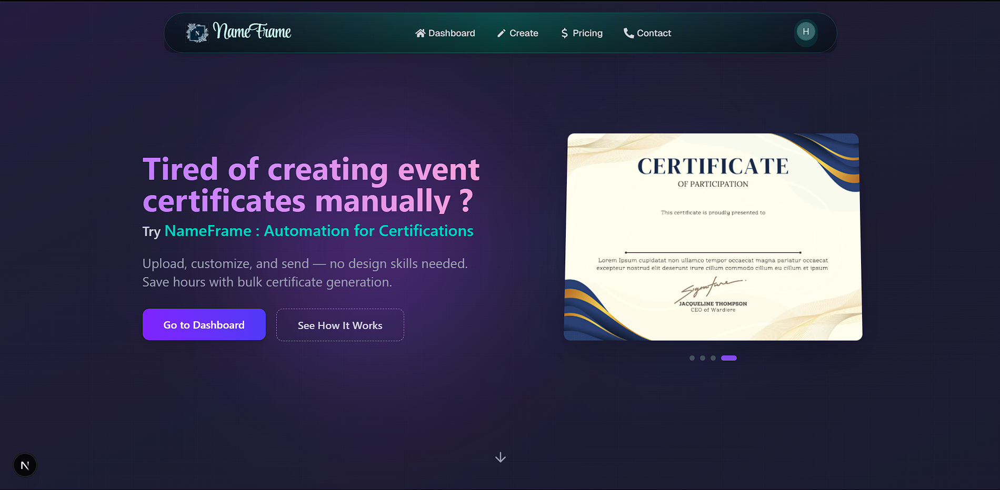
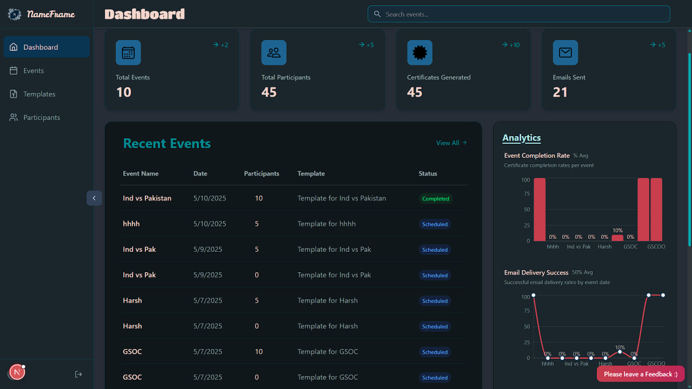
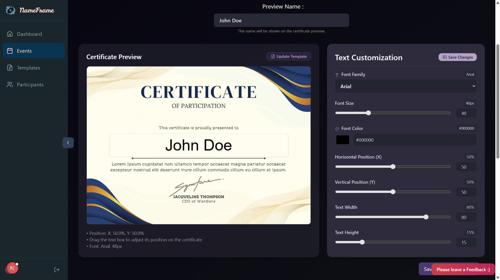
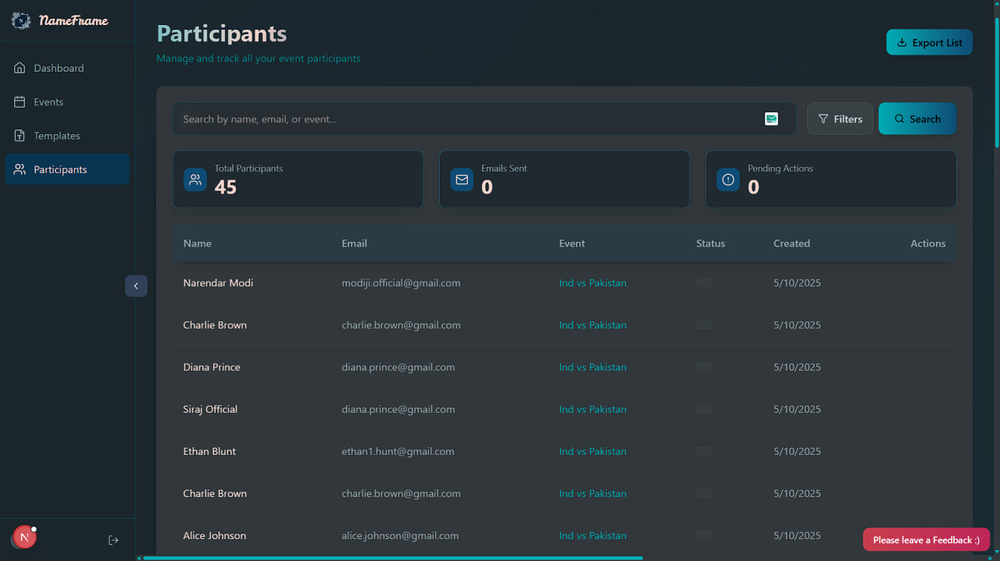

# NameFrame Certificate Generator



[](LICENSE)
[](https://github.com/nameframe/nameframe/issues)
[](https://github.com/nameframe/nameframe)

Tired of creating certificates manually? 😓 NameFrame is your solution! This dynamic certificate generator empowers event organizers to create and distribute personalized certificates effortlessly. Built with **Next.js**, **React**, and the **HTML5 Canvas API**, NameFrame offers unique certificate generation, content modification, and reliable mailing. Try it now and automate your workflow! ⭐

## Quick Start 🚀

Get started in minutes:

1. Visit the [NameFrame demo](#) (launching soon!).
2. Upload a certificate template in **4:3 format** (1440x1080 pixels, PNG/JPEG).
3. Upload an **Excel file** with participant details (columns: Name, Email).
4. Generate and download personalized certificates!

**For Developers**: Jump to [Installation & Setup](#installation--setup) to run locally.

## Features 🎉

- **Unique Certificate Generation** 🖼️  
  Create one-of-a-kind certificates with dynamic text overlays using the HTML5 Canvas API.

- **Content Modification** 🎨  
  Customize text placement, font size, and style via an intuitive UI.

- **Reliable Mailing** 📨  
  Scalable backend with rate limiting, sender rotation, and Kafka queues for bulk emailing.

- **Dashboard Management** 📊  
  Monitor certificate generation and mailing status in a modern dashboard.  
  

- **Lead Generation** 📈  
  Capture participant data for event analytics and follow-ups.

## Demo 🎥

Watch NameFrame generate personalized certificates in seconds! 🚀  

[](https://youtube.com/watch?v=placeholder)  
*Click to watch the demo on YouTube.*  

  
*Real-time certificate rendering with dynamic text overlay.*

## Certificate Template Specifications 📄

- **Format**: 4:3 aspect ratio (1440x1080 pixels recommended).  
- **Accepted Formats**: PNG or JPEG.  
- **Text Placement**: Centered horizontally, at ~60% of template height (adjustable in UI).  
- **Participant List**: Excel file with columns: **Name**, **Email**.  

  
*Text placement coordinates for certificate templates.*

## Usage 🛠️

1. **Upload Template**: Upload a 4:3 PNG/JPEG template (1440x1080 pixels).  
   

2. **Upload Participant List**: Provide an Excel file (columns: Name, Email).  
   

3. **Customize Text**: Adjust font size and placement using the preview.  
   

4. **Generate Certificates**: Preview and download as PNGs.  
5. **Send Emails**: Use the mailing system to distribute certificates.

**Tips**:  
- Use high-contrast templates for better text visibility.  
- Ensure Excel file has no empty rows in Name/Email columns.

## For Developers ⚙️

### Installation & Setup

**Prerequisites**:  
- **Node.js** (>= 14.x)  
- **npm** or **yarn**  
- **Cloudinary** account (optional for production)

**Quick Setup**:  

1. Clone the repository:  
   ```bash
   git clone https://github.com/nameframe/nameframe.git
   cd nameframe
   ```

2. Install dependencies:  
   ```bash
   npm install
   ```

3. Set up environment variables in `.env.local`:  
   ```bash
   NEXT_PUBLIC_CLOUDINARY_CLOUD_NAME=your_cloudinary_cloud_name
   NEXT_PUBLIC_CLOUDINARY_UPLOAD_PRESET=your_upload_preset
   NEXT_PUBLIC_API_URL=http://localhost:3000/api
   ```

4. Run the development server:  
   ```bash
   npm run dev
   ```

   Open [http://localhost:3000](http://localhost:3000).

**Advanced Setup** (click to expand):  
<details>
<summary>Production Build & Cloudinary</summary>

- Build for production:  
  ```bash
  npm run build
  npm run start
  ```

- Obtain Cloudinary credentials from [Cloudinary dashboard](https://cloudinary.com/).

</details>

**Troubleshooting**: Check [GitHub Issues](https://github.com/nameframe/nameframe/issues) for common problems.

### Contributing 🤝

We welcome contributions! To get started:  

1. Fork the repository.  
2. Create a feature branch:  
   ```bash
   git checkout -b feature/your-feature-name
   ```
3. Run tests:  
   ```bash
   npm test
   ```
4. Commit changes:  
   ```bash
   git commit -m "Add feature: your feature description"
   ```
5. Push and submit a pull request:  
   ```bash
   git push origin feature/your-feature-name
   ```

Check [Good First Issues](https://github.com/nameframe/nameframe/issues?q=is%3Aissue+is%3Aopen+label%3A%22good+first+issue%22) and follow our [Code of Conduct](CODE_OF_CONDUCT.md).

### Workflow 📝

We will update the workflow soon. Stay tuned!

### Roadmap 🛣️

- Launching support for smaller screens (mobile-friendly UI).  
- Integrating multiple send methods (e.g., WhatsApp, SMS).  
- Adding backup queues for mailing reliability.  

Track progress on [GitHub Issues](https://github.com/nameframe/nameframe/issues).

### Tech Stack 🛠️

- **Frontend**: Next.js, React, HTML5 Canvas API  
- **Backend**: Node.js, Kafka (for mailing)  
- **Image Management**: Cloudinary  

## License 📜

This project is licensed under the [MIT License](LICENSE).

## Acknowledgements 🙌

- Built with [Next.js](https://nextjs.org/) and [React](https://reactjs.org/).  
- Powered by [Cloudinary](https://cloudinary.com/) for image management.  
- Inspired by modern certificate automation platforms.
